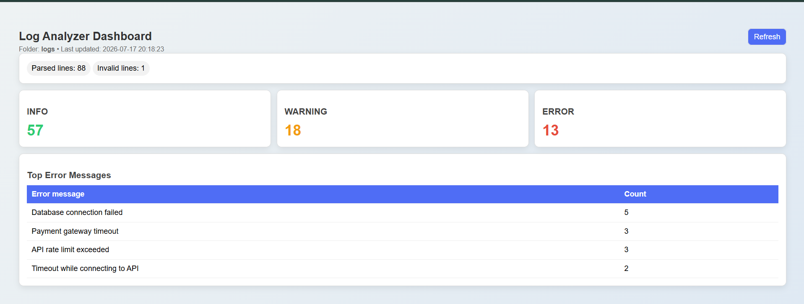

# 📊 Python Log Analyzer

A lightweight Python-based log analysis tool that parses application logs, categorizes entries by severity level, and displays key insights through an interactive dashboard.

## ✨ Features

- Parse and analyze log files
- Count INFO, WARNING, and ERROR messages
- Detect invalid log entries
- Identify top recurring errors
- Interactive dashboard with refresh support
- Clean and responsive UI

## 🛠️ Tech Stack

- Python
- Flask
- HTML
- CSS
- JavaScript

## 📈 Dashboard Insights

- Total Parsed Lines
- Invalid Log Entries
- INFO Count
- WARNING Count
- ERROR Count
- Top Error Messages

